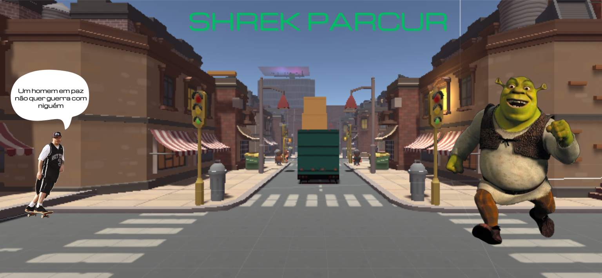
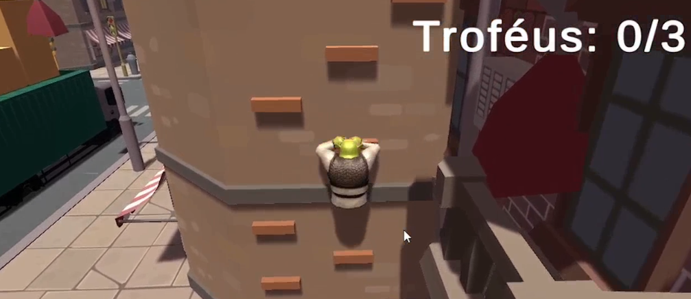
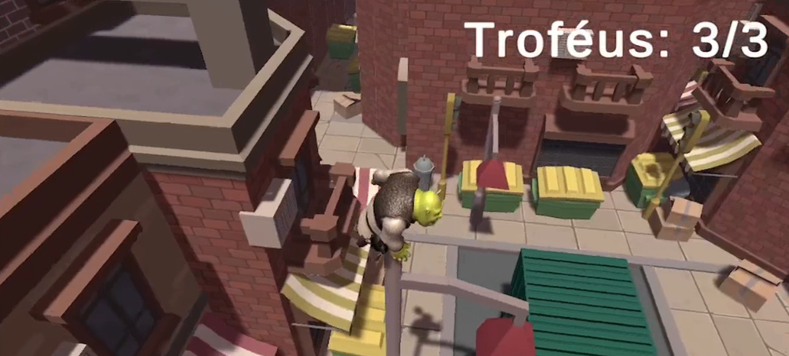
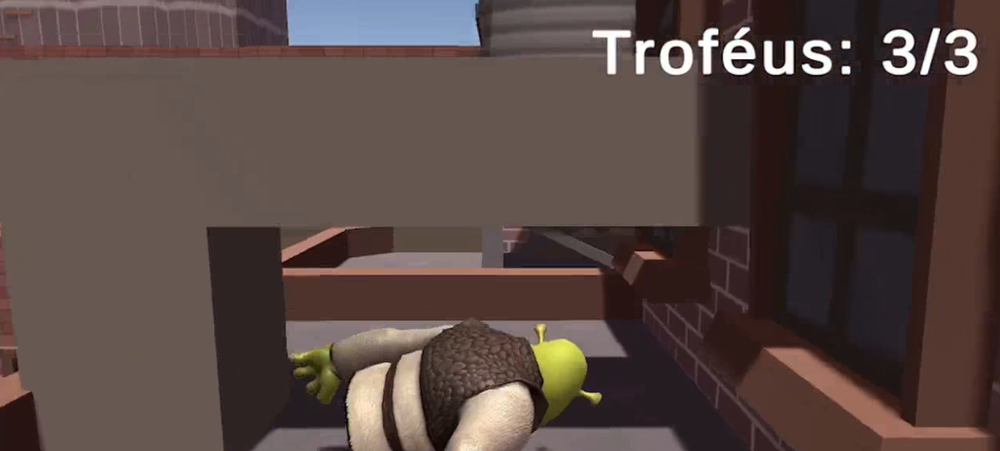

# Shrek Parkour

> Jogo de parkour do Shrek para a avaliação de computação gráfica

## Estudantes

**Nome:** Pedro Luiz Zuviollo | **Código:** 22795

**Nome:** Vinícius Gabriel Pereira Brito | **Código:** 22630

## Sobre o Jogo

> Em um futuro em que a esperança se haverá perdido, somente Shrequi pode salvar nossa copa!

> **OBJETIVO:** Colete os três troféus do brasileirão para salvar a copa do mundo

### Vídeo de Demonstração

> [VÍDEO DA GAMEPLAY](https://youtu.be/32nQ0kBwNiY)

### Prints de Demonstração

## Áreas da Computação Gráfica Utilizadas

* **Modelagem 3D:** Utilizado para renderizar os personagens, itens e cenários do jogo;

* **Animação:** Utilizado para animar os movimentos do personagem e dos itens. O personagem foi animado utilizado keyframes e o item via programação;

* **Iluminação:** Utilizando na iluminação do cenário principal e no cenário final, com holofotes coloridos na pista de dança;

* **Manipulação de Áudio:** Utilizado para as diferentes músicas do jogo.

## 🤝 Colaboradores

<table>
  <tr>
    <td align="center">
      <a href="https://github.com/Vini7Dev">
         
        
          <b>Vinícius Brito</b>
        
      </a>
    </td>

  <td align="center">
    <a href="https://github.com/preduouh">
       
      
        <b>Pedro Zuviollo</b>
      
    </a>
  </td>
  </tr>
</table>

## ‍⚖️ License
The MIT License (MIT)

Copyright (c) 2023 Vinícius Brito, Pedro Zuviollo

Permission is hereby granted, free of charge, to any person obtaining a copy of this software and associated documentation files (the "Software"), to deal in the Software without restriction, including without limitation the rights to use, copy, modify, merge, publish, distribute, sublicense, and/or sell copies of the Software, and to permit persons to whom the Software is furnished to do so, subject to the following conditions:

The above copyright notice and this permission notice shall be included in all copies or substantial portions of the Software.

THE SOFTWARE IS PROVIDED "AS IS", WITHOUT WARRANTY OF ANY KIND, EXPRESS OR IMPLIED, INCLUDING BUT NOT LIMITED TO THE WARRANTIES OF MERCHANTABILITY, FITNESS FOR A PARTICULAR PURPOSE AND NONINFRINGEMENT. IN NO EVENT SHALL THE AUTHORS OR COPYRIGHT HOLDERS BE LIABLE FOR ANY CLAIM, DAMAGES OR OTHER LIABILITY, WHETHER IN AN ACTION OF CONTRACT, TORT OR OTHERWISE, ARISING FROM, OUT OF OR IN CONNECTION WITH THE SOFTWARE OR THE USE OR OTHER DEALINGS IN THE SOFTWARE.
